---
## Front matter
title: "Отчёт по лабораторной работе №1

Компьютерный практикум по статистическому анализу данных"
subtitle: " Julia. Установка и настройка. Основные принципы."
author: "Выполнил: Исаев Булат Абубакарович, 

НПИбд-01-22, 1132227131"

## Generic otions
lang: ru-RU
toc-title: "Содержание"

## Bibliography
bibliography: bib/cite.bib
csl: pandoc/csl/gost-r-7-0-5-2008-numeric.csl

## Pdf output format
toc: true # Table of contents
toc-depth: 2
lof: true # List of figures
fontsize: 12pt
linestretch: 1.5
papersize: a4
documentclass: scrreprt
## I18n polyglossia
polyglossia-lang:
  name: russian
  options:
  - spelling=modern
  - babelshorthands=true
polyglossia-otherlangs:
  name: english
## I18n babel
babel-lang: russian
babel-otherlangs: english
## Fonts
mainfont: PT Serif
romanfont: PT Serif
sansfont: PT Sans
monofont: PT Mono
mainfontoptions: Ligatures=TeX
romanfontoptions: Ligatures=TeX
sansfontoptions: Ligatures=TeX,Scale=MatchLowercase
monofontoptions: Scale=MatchLowercase,Scale=0.9
## Biblatex
biblatex: true
biblio-style: "gost-numeric"
biblatexoptions:
  - parentracker=true
  - backend=biber
  - hyperref=auto
  - language=auto
  - autolang=other*
  - citestyle=gost-numeric
## Pandoc-crossref LaTeX customization
figureTitle: "Рис."
tableTitle: "Таблица"
listingTitle: "Листинг"
lofTitle: "Список иллюстраций"
lolTitle: "Листинги"
## Misc options
indent: true
header-includes:
  - \usepackage{indentfirst}
  - \usepackage{float} # keep figures where there are in the text
  - \floatplacement{figure}{H} # keep figures where there are in the text
---

# Цель работы

Основная цель работы — подготовить рабочее пространство и инструментарий для 
работы с языком программирования Julia, на простейших примерах познакомиться 
с основами синтаксиса Julia.
 
# Выполнение лабораторной работы

## Подготовка инструментария к работе

Так как мы используем ОС типа Windows для различных установок будем использовать менеджер пакетов
Chocolatey (https://chocolatey.org/), который устанавим через Administrative Shell (рис. [-@fig:001]):

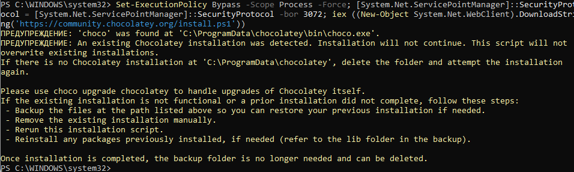{ #fig:001 width=100% height=100% }

Далее посредством установленного менеджера установим Far Manager, Notepad++, Julia,
Anaconda Distribution (Python 3.x) (рис. [-@fig:002] - рис. [-@fig:005]):

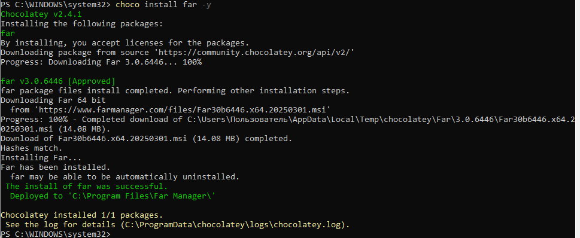{ #fig:002 width=100% height=100% }

{ #fig:003 width=100% height=100% }

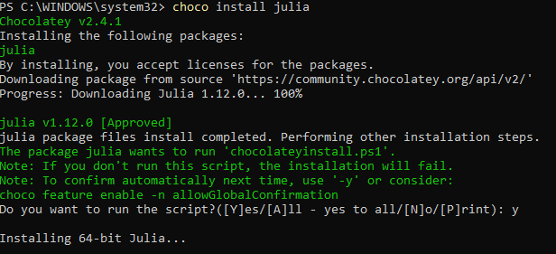{ #fig:004 width=100% height=100% }

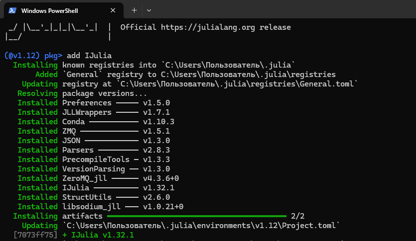{ #fig:005 width=100% height=100% }

Сдедующим шагом установим пакеты для работы с Jupyter. Для этого перейдём в пакетный режим
Julia, нажав на клавиатуре знак закрывающейся квадратной скобки ], затем введём  add IJulia (рис. [-@fig:006]):

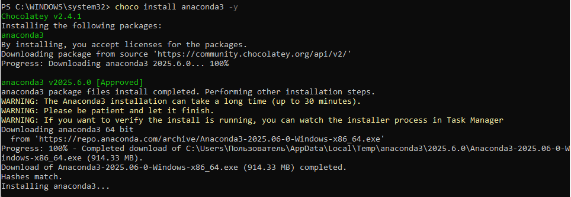{ #fig:006 width=100% height=100% }

## Основы синтаксиса Julia на примерах

Для начала потренируемся с определением типов числовых величин (рис. [-@fig:007]):

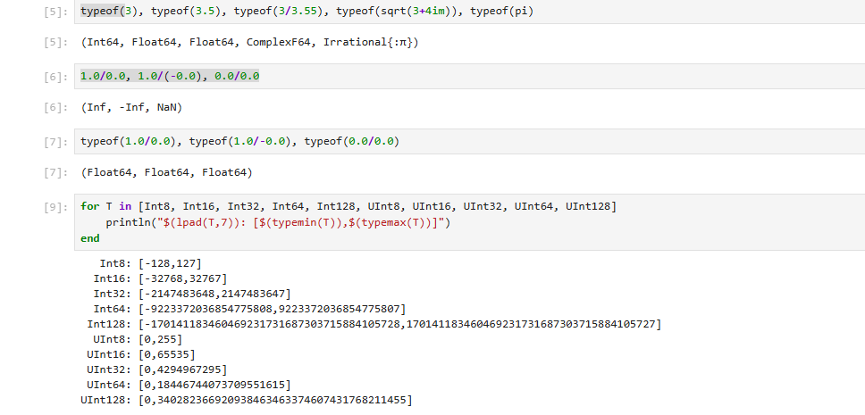{ #fig:007 width=100% height=100% }

После чего приступим к рассмотрению приведения аргументов к одному типу (рис. [-@fig:008]):

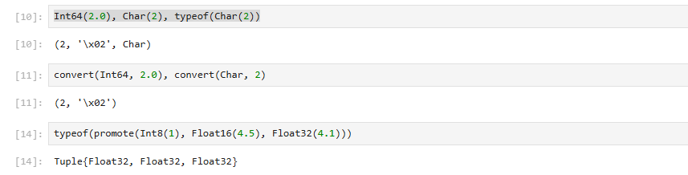{ #fig:008 width=100% height=100% }

И рассмотрим примеры определения функций (рис. [-@fig:009]), а также работу с массивами (рис. [-@fig:010]):

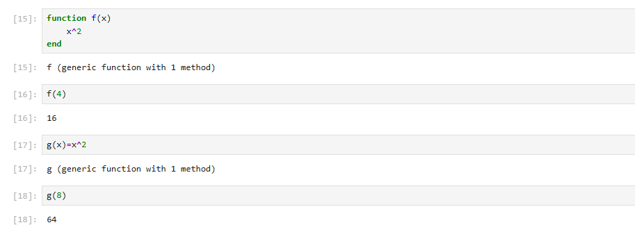{ #fig:009 width=100% height=100% }

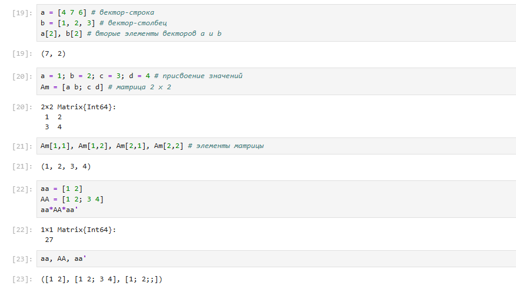{ #fig:010 width=100% height=100% }

## Самостоятельная работа

В первом задании ма рассмотрим основные функции для чтения / записи / вывода информации на экран. Для этого
составим свои примеры (рис. [-@fig:011]):

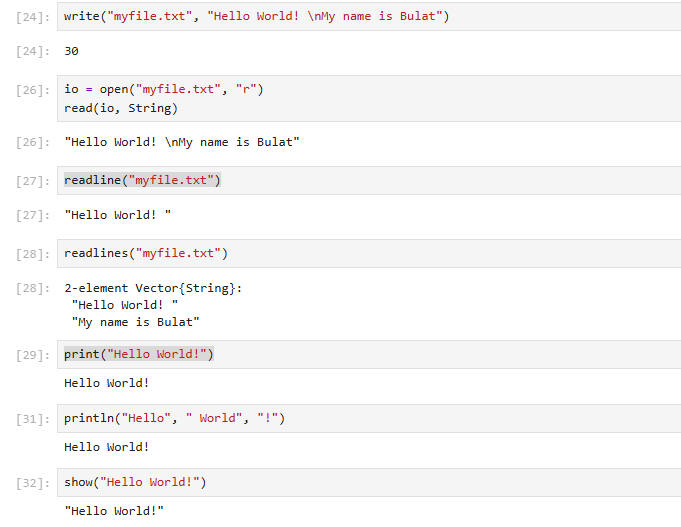{ #fig:011 width=100% height=100% }

Во втором задании состаивим пример для функции parse() (рис. [-@fig:012]):

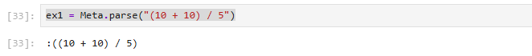{ #fig:012 width=100% height=100% }

Далее изучим синтаксис Julia для базовых математических операций с разным типом переменных (рис. [-@fig:013] - рис. [-@fig:014]):

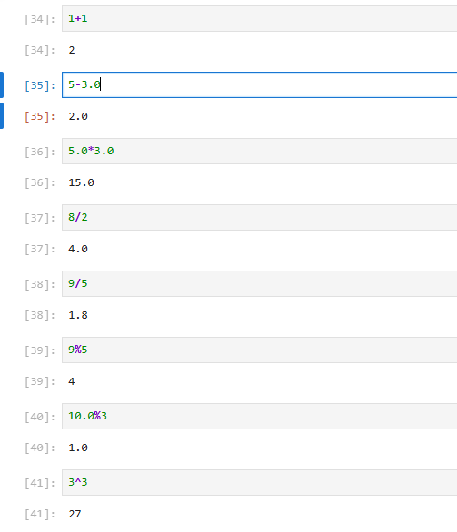{ #fig:013 width=100% height=100% }

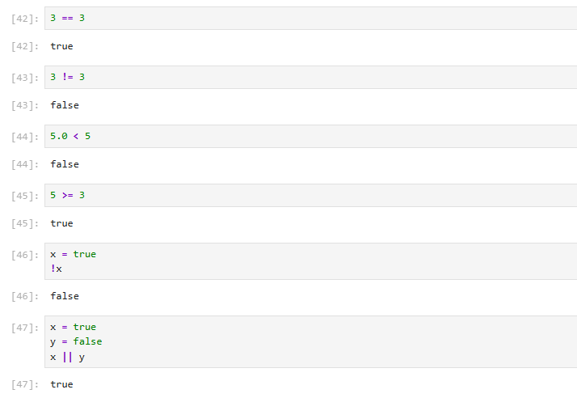{ #fig:014 width=100% height=100% }

В конце работы приведём несколько примеров с операциями над матрицами (рис. [-@fig:015]):

{ #fig:015 width=100% height=100% }

# Вывод

В ходе выполнения лабораторной работы были получены навыки по подготовке рабочего пространства и 
инструментария для работы с языком программирования Julia, а также познакомились на простейших 
примерах с основами синтаксиса Julia.

# Список литературы. Библиография

[1] Julia Documentation: https://docs.julialang.org/en/v1/

