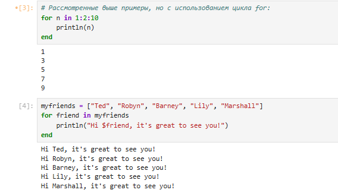
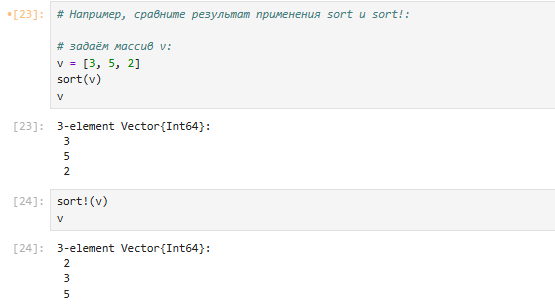
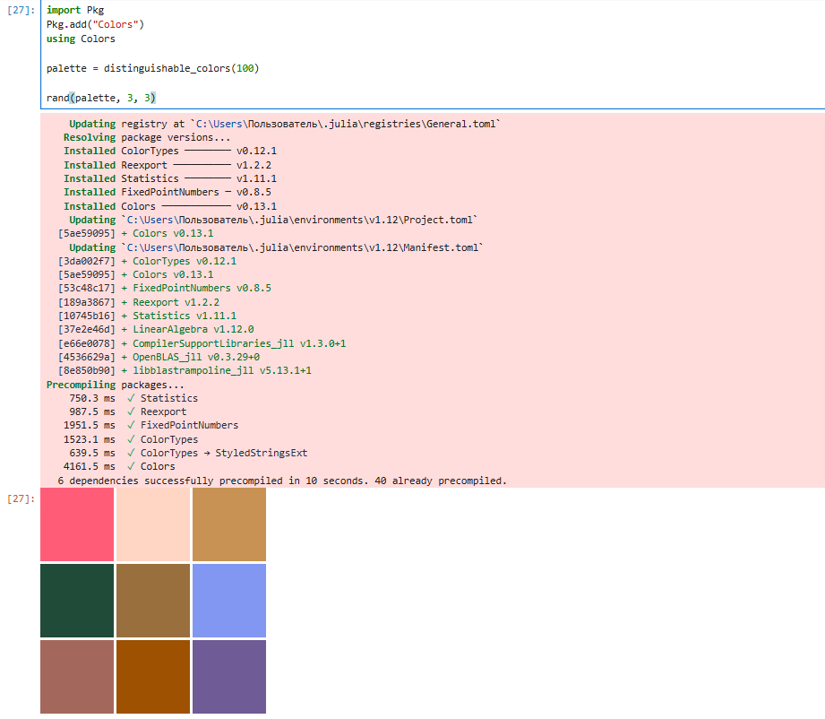
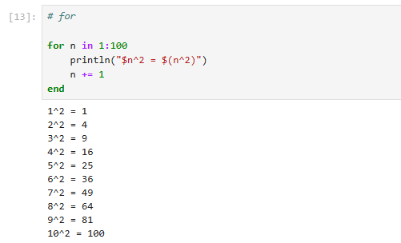
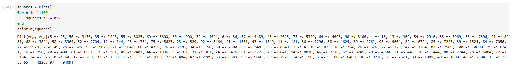
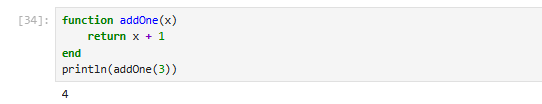
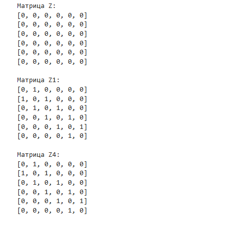
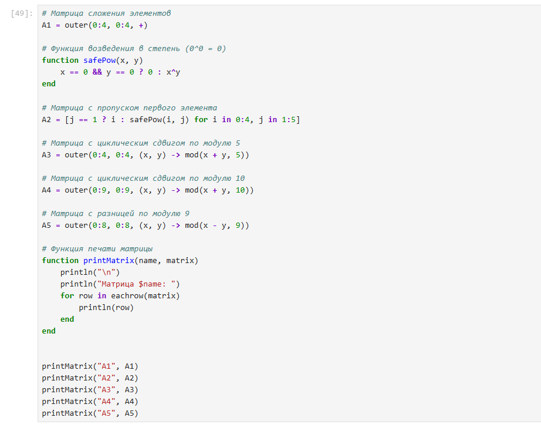
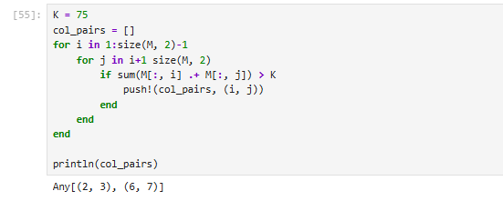
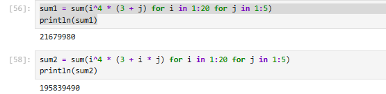

---
## Front matter
title: "Отчёт по лабораторной работе №3


Компьютерный практикум по статистическому анализу данных"
subtitle: "Управляющие структуры"
author: "Выполнил: Исаев Булат Абубакарович, 


НПИбд-01-22, 1132227131"

## Generic otions
lang: ru-RU
toc-title: "Содержание"

## Bibliography
bibliography: bib/cite.bib
csl: pandoc/csl/gost-r-7-0-5-2008-numeric.csl

## Pdf output format
toc: true # Table of contents
toc-depth: 2
lof: true # List of figures
fontsize: 12pt
linestretch: 1.5
papersize: a4
documentclass: scrreprt
## I18n polyglossia
polyglossia-lang:
  name: russian
  options:
  - spelling=modern
  - babelshorthands=true
polyglossia-otherlangs:
  name: english
## I18n babel
babel-lang: russian
babel-otherlangs: english
## Fonts
mainfont: PT Serif
romanfont: PT Serif
sansfont: PT Sans
monofont: PT Mono
mainfontoptions: Ligatures=TeX
romanfontoptions: Ligatures=TeX
sansfontoptions: Ligatures=TeX,Scale=MatchLowercase
monofontoptions: Scale=MatchLowercase,Scale=0.9
## Biblatex
biblatex: true
biblio-style: "gost-numeric"
biblatexoptions:
  - parentracker=true
  - backend=biber
  - hyperref=auto
  - language=auto
  - autolang=other*
  - citestyle=gost-numeric
## Pandoc-crossref LaTeX customization
figureTitle: "Рис."
tableTitle: "Таблица"
listingTitle: "Листинг"
lofTitle: "Список иллюстраций"
lolTitle: "Листинги"
## Misc options
indent: true
header-includes:
  - \usepackage{indentfirst}
  - \usepackage{float} # keep figures where there are in the text
  - \floatplacement{figure}{H} # keep figures where there are in the text
---

# Цель работы

Основная цель работы — освоить применение циклов функций и сторонних для Julia
пакетов для решения задач линейной алгебры и работы с матрицами.
 
# Выполнение лабораторной работы

##  Циклы while и for

Для различных операций, связанных с перебором индексируемых элементов структур
данных, традиционно используются циклы while и for.

Синтаксис while

``` Julia
while <условие>
    <тело цикла>
end
```

Примеры использования цикла while (рис. [-@fig:001]):

{ #fig:001 width=100% height=100% }

Такие же результаты можно получить при использовании цикла for.

Синтаксис for

``` Julia
for <переменная> in <диапазон>
    <тело цикла>
end
```

Примеры использования цикла for (рис. [-@fig:002]):

{ #fig:002 width=100% height=100% }

Пример использования цикла for для создания двумерного массива, в котором значение каждой записи 
является суммой индексов строки и столбца (рис. [-@fig:003]):

{ #fig:003 width=100% height=100% }

## Условные выражения

Довольно часто при решении задач требуется проверить выполнение тех или иных
условий. Для этого используют условные выражения.

Синтаксис условных выражений с ключевым словом:

``` Julia
if <условие 1>
    <действие 1>
elseif <условие 2>
    <действие 2>
else
    <действие 3>
end
```

Примеры использования условного выражения (рис. [-@fig:004]):

{ #fig:004 width=100% height=100% }

## Функции

Julia дает нам несколько разных способов написать функцию. 

Примеры способов написания функции (рис. [-@fig:005]):

{ #fig:005 width=100% height=100% }

По соглашению в Julia функции, сопровождаемые восклицательным знаком, изменяют
свое содержимое, а функции без восклицательного знака не делают этого (рис. [-@fig:006]):

{ #fig:006 width=100% height=100% }

В Julia функция map является функцией высшего порядка, которая принимает функцию
в качестве одного из своих входных аргументов и применяет эту функцию к каждому
элементу структуры данных, которая ей передаётся также в качестве аргумента.

Функция broadcast — ещё одна функция высшего порядка в Julia, представляющая собой обобщение 
функции map.Функция broadcast() будет пытаться привести все объекты
к общему измерению, map() будет напрямую применять данную функцию поэлементно.

Примеры использования функций map() и broadcast() (рис. [-@fig:007]):

{ #fig:007 width=100% height=100% }

## Сторонние библиотеки (пакеты) в Julia

Julia имеет более 2000 зарегистрированных пакетов, что делает их огромной частью
экосистемы Julia. Есть вызовы функций первого класса для других языков, обеспечивающие интерфейсы сторонних функций. Можно вызвать функции из Python или R,
например, с помощью PyCall или Rcall.

С перечнем доступных в Julia пакетов можно ознакомиться на страницах следующих
ресурсов:
- https://julialang.org/packages/
- https://juliahub.com/ui/Home
- https://juliaobserver.com/
- https://github.com/svaksha/Julia.jl

При первом использовании пакета в вашей текущей установке Julia вам необходимо
использовать менеджер пакетов, чтобы явно его добавить:

``` Julia
import Pkg
Pkg.add("Example")
```

При каждом новом использовании Julia (например, в начале нового сеанса в REPL
или открытии блокнота в первый раз) нужно загрузить пакет, используя ключевое слово
using:

Например, добавим и загрузим пакет Colors:

``` Julia
Pkg.add("Colors")
using Colors
```

Затем создадим палитру из 100 разных цветов:

``` Julia
palette = distinguishable_colors(100)
```

А затем определим матрицу 3 × 3 с элементами в форме случайного цвета из палитры,
используя функцию rand:

``` Julia
rand(palette, 3, 3)
```

Пример использования сторонних библиотек (рис. [-@fig:008]):

{ #fig:008 width=100% height=100% }

## Самостоятельная работа

Выполнение задания №1 (рис. [-@fig:009] - рис. [-@fig:012]):

{ #fig:009 width=100% height=100% }

{ #fig:010 width=100% height=100% }

{ #fig:011 width=100% height=100% }

{ #fig:012 width=100% height=100% }

Выполнение задания №2 (рис. [-@fig:013]):

{ #fig:013 width=100% height=100% }

Выполнение задания №3 (рис. [-@fig:013]):

{ #fig:014 width=100% height=100% }

Выполнение задания №4 (рис. [-@fig:015]):

{ #fig:015 width=100% height=100% }

Выполнение задания №5 (рис. [-@fig:016]):

{ #fig:016 width=100% height=100% }

Выполнение задания №6 (рис. [-@fig:017]):

{ #fig:017 width=100% height=100% }

Выполнение задания №7 (рис. [-@fig:018] - рис. [-@fig:019]):

{ #fig:018 width=100% height=100% }

{ #fig:019 width=100% height=100% }

Выполнение задания №8 (рис. [-@fig:020] - рис. [-@fig:022]):

{ #fig:020 width=100% height=100% }

{ #fig:021 width=100% height=100% }

{ #fig:022 width=100% height=100% }

Выполнение задания №9 (рис. [-@fig:023]):

{ #fig:023 width=100% height=100% }

Выполнение задания №10 (рис. [-@fig:024] - рис. [-@fig:025]):

{ #fig:024 width=100% height=100% }

{ #fig:025 width=100% height=100% }

Выполнение задания №11 (рис. [-@fig:026]):

{ #fig:026 width=100% height=100% }

# Вывод

В ходе выполнения лабораторной работы было освоено применение циклов функций и сторонних для Julia
пакетов для решения задач линейной алгебры и работы с матрицами.

# Список литературы. Библиография


[1] Julia Documentation: https://docs.julialang.org/en/v1/


