---
## Front matter
title: "Отчёт по лабораторной работе №7

Компьютерный практикум по статистическому анализу данных"
subtitle: "Введение в работу с данными"
author: "Выполнил: Исаев Булат Абубакарович, 

НПИбд-01-22, 1132227131"

## Generic otions
lang: ru-RU
toc-title: "Содержание"

## Bibliography
bibliography: bib/cite.bib
csl: pandoc/csl/gost-r-7-0-5-2008-numeric.csl

## Pdf output format
toc: true # Table of contents
toc-depth: 2
lof: true # List of figures
fontsize: 12pt
linestretch: 1.5
papersize: a4
documentclass: scrreprt
## I18n polyglossia
polyglossia-lang:
  name: russian
  options:
	- spelling=modern
	- babelshorthands=true
polyglossia-otherlangs:
  name: english
## I18n babel
babel-lang: russian
babel-otherlangs: english
## Fonts
mainfont: PT Serif
romanfont: PT Serif
sansfont: PT Sans
monofont: PT Mono
mainfontoptions: Ligatures=TeX
romanfontoptions: Ligatures=TeX
sansfontoptions: Ligatures=TeX,Scale=MatchLowercase
monofontoptions: Scale=MatchLowercase,Scale=0.9
## Biblatex
biblatex: true
biblio-style: "gost-numeric"
biblatexoptions:
  - parentracker=true
  - backend=biber
  - hyperref=auto
  - language=auto
  - autolang=other*
  - citestyle=gost-numeric
## Pandoc-crossref LaTeX customization
figureTitle: "Рис."
tableTitle: "Таблица"
listingTitle: "Листинг"
lofTitle: "Список иллюстраций"
lolTitle: "Листинги"
## Misc options
indent: true
header-includes:
  - \usepackage{indentfirst}
  - \usepackage{float} # keep figures where there are in the text
  - \floatplacement{figure}{H} # keep figures where there are in the text
---

# Цель работы

Основной целью работы является изучение специализированных пакетов Julia для обработки данных.
 
# Выполнение лабораторной работы

## Julia для науки о данных

В Julia для обработки данных используются наработки из других языков программирования, в частности, из R и Python.

## Считывание данных

Перед тем, как начать проводить какие-либо операции над данными, необходимо их откуда-то считать и 
возможно сохранить в определённой структуре. 

Довольно часто данные для обработки содержаться в csv-файле, имеющим текстовый формат, в котором 
данные в строке разделены, например, запятыми, и соответствуют ячейкам таблицы, а строки данных 
соответствуют строкам таблицы. Также данные могут быть представлены в виде фреймов или множеств.

В Julia для работы с такого рода структурами данных используют пакеты CSV, DataFrames, RDatasets, FileIO (рис. [-@fig:001]):

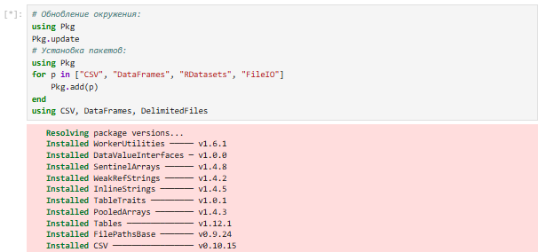{ #fig:001 width=100% height=100% }

Предположим, что у нас в рабочем каталоге с проектом есть файл с данными programminglanguages.csv, 
содержащий перечень языков программирования и год их создания. Тогда для заполнения массива данными 
для последующей обработки требуется считать данные из исходного файла и записать их в соответствующую 
структуру (рис. [-@fig:002]):

{ #fig:002 width=100% height=100% }

Пример для Julia (рис. [-@fig:003]):

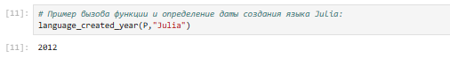{ #fig:003 width=100% height=100% }

В следующем примере при вызове функции, в качестве аргумента которой указано слово julia, написанное со строчной буквы (рис. [-@fig:004]):

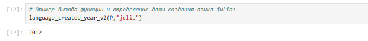{ #fig:004 width=100% height=100% }

Для того, чтобы убрать в функции зависимость данных от регистра, необходимо изменить исходную функцию следующим образом (рис. [-@fig:005]):

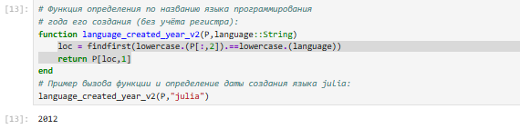{ #fig:005 width=100% height=100% }

Можно считывать данные построчно, с элементами, разделенными заданным разделителем (рис. [-@fig:006]):

{ #fig:006 width=100% height=100% }

## Запись данных в файл

Предположим, что требуется записать имеющиеся данные в файл. Для записи данных в формате CSV можно 
воспользоваться следующим вызовом (рис. [-@fig:007]):

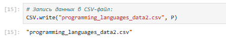{ #fig:007 width=100% height=100% }

Можно задать тип файла и разделитель данных (рис. [-@fig:008]):

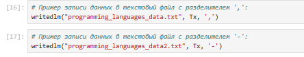{ #fig:008 width=100% height=100% }

Можно проверить, используя readdlm, корректность считывания созданного текстового файла (рис. [-@fig:009]):

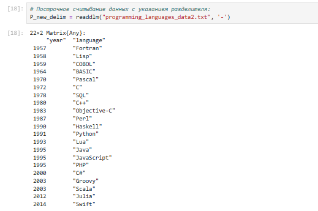{ #fig:009 width=100% height=100% }

## Словари

При работе с данными бывает удобно записать их в формате словаря.

Предположим, что словарь должен содержать перечень всех языков программирования и года их создания, 
при этом при указании года выводить все языки программирования, созданные в этом году.

При инициализации словаря можно задать конкретные типы данных для ключей и значений (рис. [-@fig:010]):

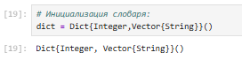{ #fig:010 width=100% height=100% }

Можно инициировать пустой словарь, не задавая строго структуру (рис. [-@fig:011]):

{ #fig:011 width=100% height=100% }

Далее требуется заполнить словарь ключами и годами, которые содержат все языки программирования, 
созданные в каждом году, в качестве значений (рис. [-@fig:012]):

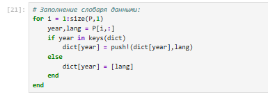{ #fig:012 width=100% height=100% }

В результате при вызове словаря можно, выбрав любой год, узнать, какие языки программирования были созданы в этом году (рис. [-@fig:013]):

{ #fig:013 width=100% height=100% }

## DataFrames

Работа с данными, записанными в структуре DataFrame, позволяет использовать индексацию и получить доступ к столбцам по заданному имени заголовка или по индексу столбца.

На примере с данными о языках программирования и годах их создания зададим структуру DataFrame (рис. [-@fig:014]):

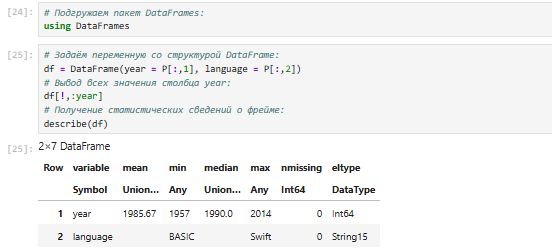{ #fig:014 width=100% height=100% }

## RDatasets

С данными можно работать также как с наборами данных через пакет RDatasets языка R (рис. [-@fig:015]):

{ #fig:015 width=100% height=100% }

Пакет RDatasets также предоставляет возможность с помощью description получить основные статистические 
сведения о каждом столбце в наборе данных (рис. [-@fig:016]):

{ #fig:016 width=100% height=100% }

## Работа с переменными отсутствующего типа (Missing Values)

Пакет DataFrames позволяет использовать так называемый «отсутствующий» тип (рис. [-@fig:017]):

{ #fig:017 width=100% height=100% }

В операции сложения числа и переменной с отсутствующим типом значение также будет иметь отсутствующий 
тип (рис. [-@fig:018]):

{ #fig:018 width=100% height=100% }

Приведём пример работы с данными, среди которых есть данные с отсутствующим типом.

Предположим есть перечень продуктов, для которых заданы калории. В массиве значений калорий есть значение с отсутствующим 
типом (рис. [-@fig:019]):

{ #fig:019 width=100% height=100% }

При попытке получить среднее значение калорий, ничего не получится из-за наличия переменной с отсутствующим типом.

Для решения этой проблемы необходимо игнорировать отсутствующий тип (рис. [-@fig:020]):

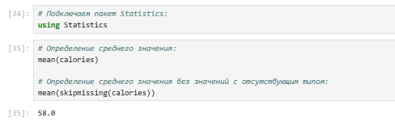{ #fig:020 width=100% height=100% }

Далее показано, как можно сформировать таблицы данных и объединить их в один фрейм (рис. [-@fig:021]):

{ #fig:021 width=100% height=100% }

## FileIO

В Julia можно работать с так называемыми «сырыми» данными, используя пакет FileIO. 

Попробуем посмотреть, как Julia работает с изображениями.

Подключим соответствующий пакет (рис. [-@fig:022]):

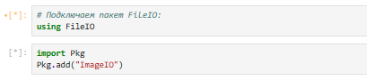{ #fig:022 width=100% height=100% }

Загрузим изображение (в данном случае логотип Julia) (рис. [-@fig:023]):

{ #fig:023 width=100% height=100% }

Julia хранит изображение в виде множества цветов (рис. [-@fig:024]):

{ #fig:024 width=100% height=100% }

## Обработка данных: стандартные алгоритмы машинного обучения в Julia. Кластеризация данных. Метод k-средних

Задача кластеризации данных заключается в формировании однородной группы упорядоченных по какому-то признаку данных.

Метод k-средних позволяет минимизировать суммарное квадратичное отклонение точек кластеров от центров этих кластеров.

Рассмотрим задачу кластеризации данных на примере данных о недвижимости. Файл с данными houses.csv 
содержит список транзакций с недвижимостью в районе Сакраменто, о которых было сообщено в течение 
определённого числа дней.

Сначала подключим необходимые для работы пакеты (рис. [-@fig:025]):

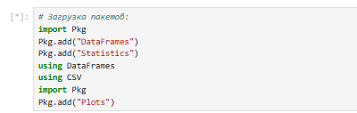{ #fig:025 width=100% height=100% }

Затем загрузим данные (рис. [-@fig:026]):

{ #fig:026 width=100% height=100% }

Построим график цен на недвижимость в зависимости от площади (рис. [-@fig:027]):

{ #fig:027 width=100% height=100% }

Для того чтобы избавиться от "артефактов", можно отфильтровать и исключить такие значения, получить более корректный график цен  (рис. [-@fig:028]):

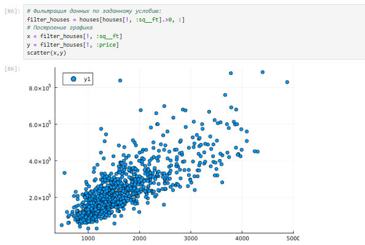{ #fig:028 width=100% height=100% }

Построим график, обозначив каждый кластер отдельным цветом (рис. [-@fig:029]):

{ #fig:029 width=100% height=100% }

Построим график, раскрасив кластеры по почтовому индексу (рис. [-@fig:030]):

{ #fig:030 width=100% height=100% }

## Кластеризация данных. Метод k ближайших соседей

Отобразим на графике соседей выбранного объекта недвижимости (рис. [-@fig:031]):

{ #fig:031 width=100% height=100% }

Используя индексы idxs и функцию :city для индексации в DataFrame filter_houses, можно определить 
районы соседних домов (рис. [-@fig:032]):

{ #fig:032 width=100% height=100% }

## Обработка данных. Метод главных компонент

Метод главных компонент (Principal Components Analysis, PCA) позволяет уменьшить размерность данных, 
потеряв наименьшее количество полезной информации. Метод имеет широкое применение в различных областях 
знаний, например, при визуализации данных, компрессии изображений, в эконометрике, некоторых 
гуманитарных предметных областях, например, в социологии или в политологии.

На примере с данными о недвижимости попробуем уменьшить размеры данных о цене и площади из набора 
данных домов (рис. [-@fig:033]):

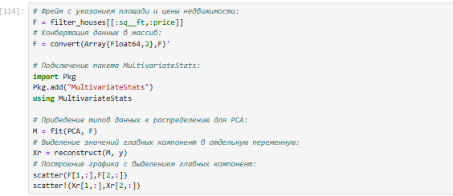{ #fig:033 width=100% height=100% }

## Обработка данных. Линейная регрессия

Регрессионный анализ представляет собой набор статистических методов исследования влияния одной или нескольких независимых 
переменных (регрессоров) на зависимую (критериальная) переменную. Терминология зависимых и независимых
переменных отражает лишь математическую зависимость переменных, а не причинноследственные отношения.

Наиболее распространённый вид регрессионного анализа — линейная регрессия, когда находят линейную 
функцию, которая согласно определённым математическим критериям наиболее соответствует данным.

Зададим случайный набор данных (можно использовать и полученные экспериментальным путём какие-то данные). 
Попробуем найти для данных лучшее соответствие (рис. [-@fig:034]):

{ #fig:034 width=100% height=100% }

Определим функцию линейной регрессии. Применим функцию линейной регрессии для построения 
соответствующего графика значений (рис. [-@fig:035]):

{ #fig:035 width=100% height=100% }

Сгенерируем больший набор данных. Определим, сколько времени потребуется, чтобы найти соответствие 
этим данным. Для сравнения реализуем подобный код на языке Python. Используем пакет для анализа производительности, 
чтобы провести сравнение (рис. [-@fig:036]):

{ #fig:036 width=100% height=100% }

## Самостоятельное выполнение

Выполнение задания №1 (рис. [-@fig:037]):

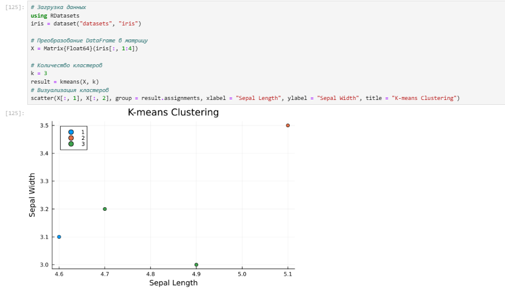{ #fig:037 width=100% height=100% }

Выполнение задания №2 (рис. [-@fig:038] - рис. [-@fig:039]):

{ #fig:038 width=100% height=100% }

{ #fig:039 width=100% height=100% }

Выполнение задания №3 (рис. [-@fig:040] - рис. [-@fig:042]):

{ #fig:040 width=100% height=100% }

{ #fig:041 width=100% height=100% }

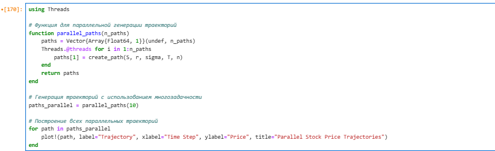{ #fig:042 width=100% height=100% }

# Вывод

В ходе выполнения лабораторной работы были изучены специализированные пакеты Julia для обработки данных.

# Список литературы. Библиография

[1] Julia Documentation: https://docs.julialang.org/en/v1/
