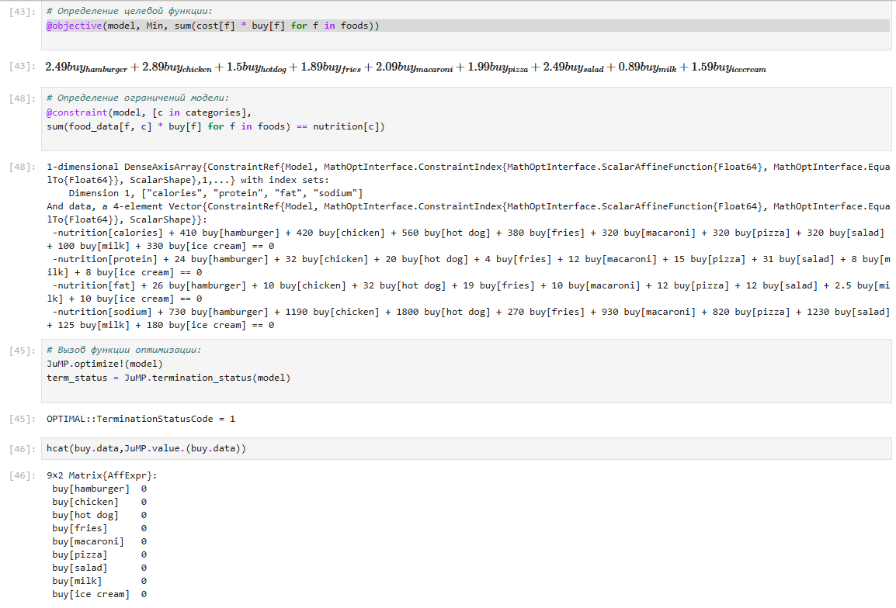
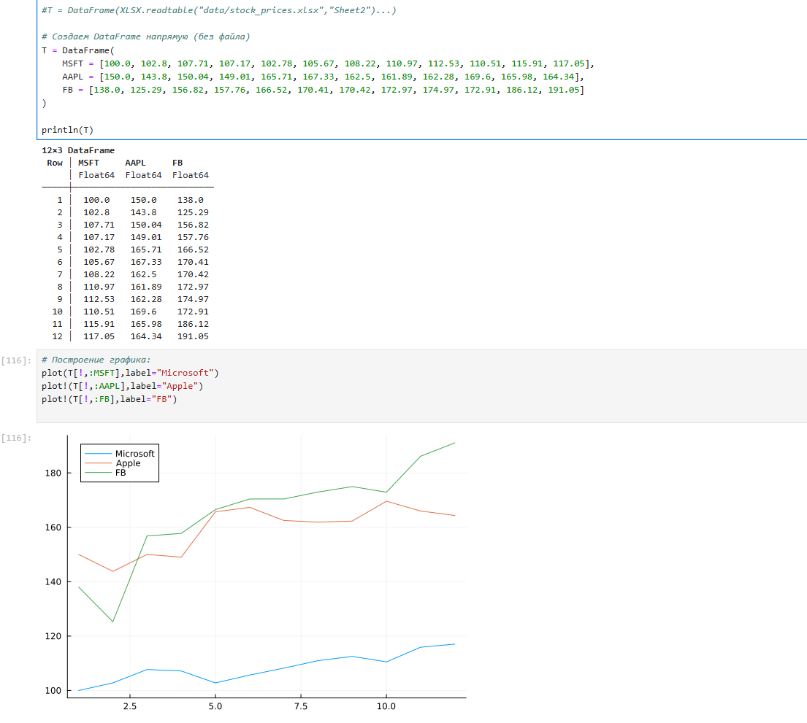
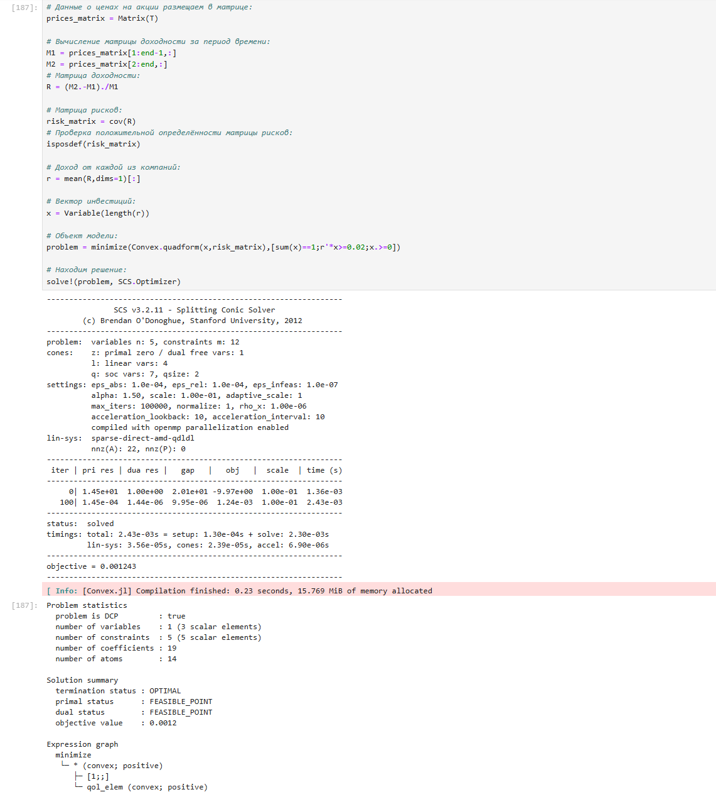
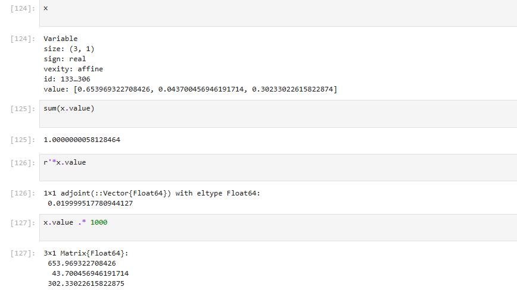
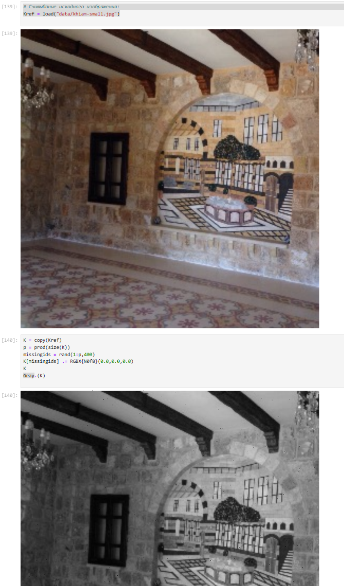
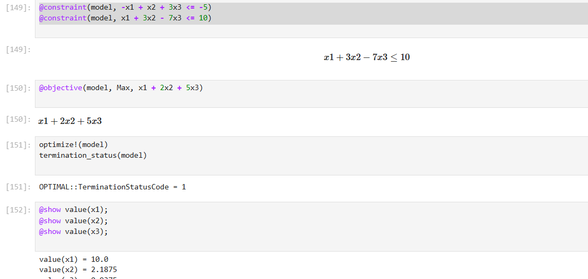
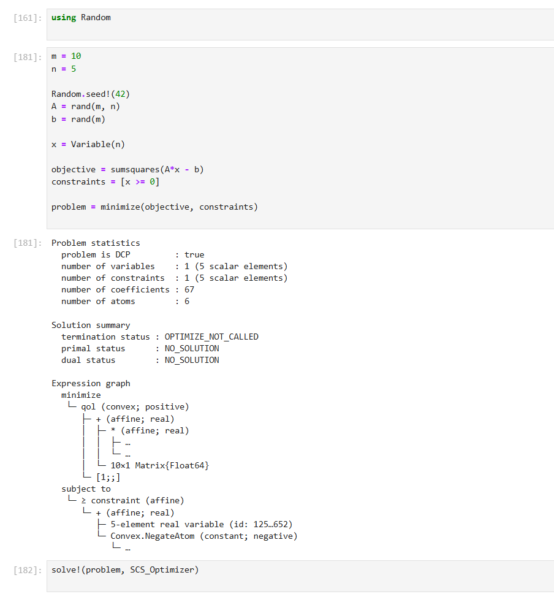

---
## Front matter
lang: ru-RU
title: Лабораторная работа № 8
subtitle: Оптимизация
author:
  - Исаев Б. А.
institute:
  - Российский университет дружбы народов, Москва, Россия

## i18n babel
babel-lang: russian
babel-otherlangs: english

## Formatting pdf
toc: false
toc-title: Содержание
slide_level: 2
aspectratio: 169
section-titles: true
theme: metropolis
header-includes:
 - \metroset{progressbar=frametitle,sectionpage=progressbar,numbering=fraction}
---

# Информация

## Докладчик

:::::::::::::: {.columns align=center}
::: {.column width="70%"}

  * Исаев Булат Абубакарович
  * Студент группы НПИбд-01-22
  * Студ. билет 1132227131
  * Российский университет дружбы народов имени Патриса Лумумбы

:::
::: {.column width="25%"}
:::
::::::::::::::

## Цель лабораторной работы

Основная цель работы -- освоить пакеты Julia для решения задач оптимизации.

# Выполнение лабораторной работы

# Подготовка инструментария к работе

## Выполнение лабораторной работы

{#fig:001 width=40%}

## Выполнение лабораторной работы

{#fig:002 width=40%}

## Выполнение лабораторной работы

{#fig:003 width=45%}

## Выполнение лабораторной работы

{#fig:004 width=45%}

## Выполнение лабораторной работы

{#fig:005 width=45%}

## Выполнение лабораторной работы

{#fig:006 width=45%}

## Выполнение лабораторной работы

{#fig:007 width=45%}

## Выполнение лабораторной работы

{#fig:008 width=40%}

## Выполнение лабораторной работы

{#fig:008 width=40%}

## Выполнение лабораторной работы

{#fig:009 width=45%}

## Выполнение лабораторной работы

{#fig:010 width=45%}

## Выполнение лабораторной работы

{#fig:011 width=70%}

## Выполнение лабораторной работы

{#fig:012 width=45%}

## Выполнение лабораторной работы

{#fig:013 width=40%}

## Выполнение лабораторной работы

{#fig:014 width=35%}

## Выполнение лабораторной работы

{#fig:015 width=35%}

## Выполнение лабораторной работы

{#fig:016 width=45%}

## Вывод

В результате выполнения данной лабораторной работы я оосвоила пакеты Julia для решения задач оптимизации.

## Список литературы

1. JuliaLang [Электронный ресурс]. 2024 JuliaLang.org contributors. URL:https://julialang.org/(дата обращения: 11.10.2024).
2. Julia  1.11  Documentation  [Электронный  ресурс].  2024  JuliaLang.orgcontributors. URL:https://docs.julialang.org/en/v1/(дата обращения:11.10.2024).
